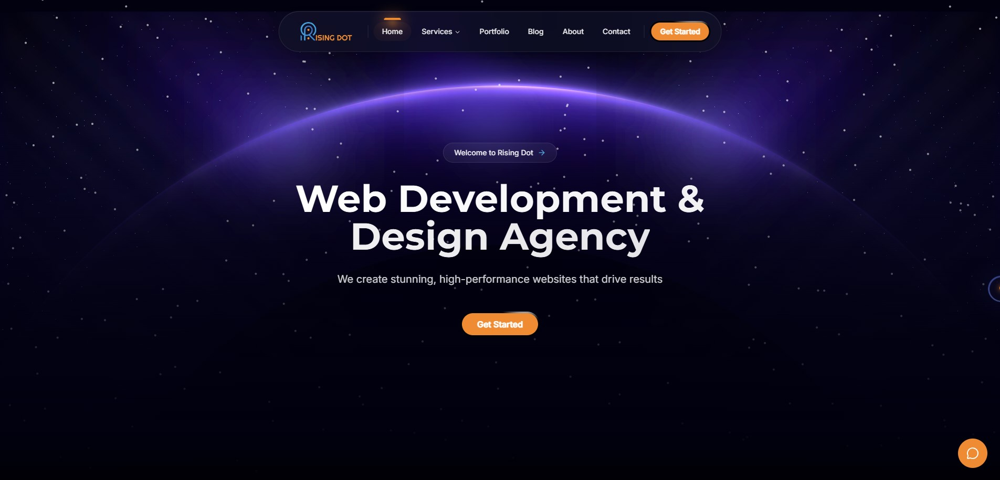
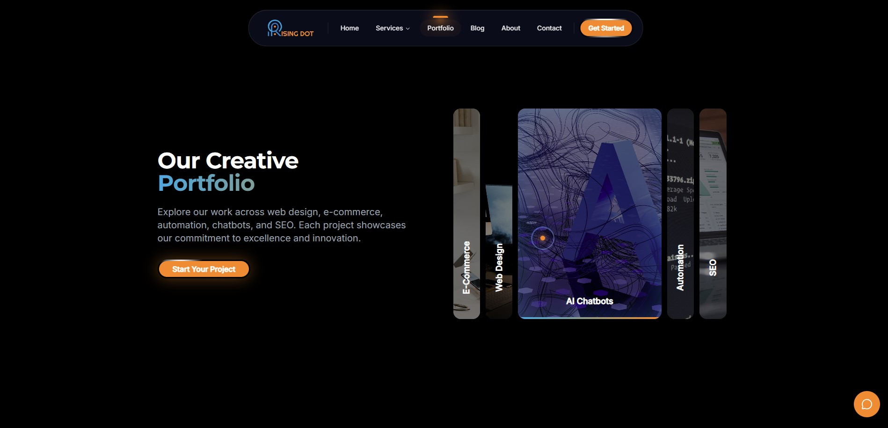
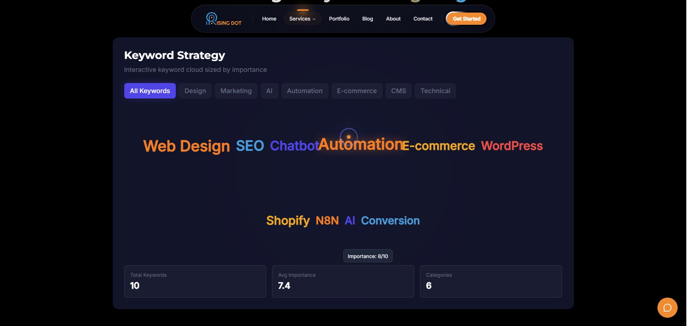

# SiliconHubs

A modern, high-performance web development agency website built with Next.js 14, featuring stunning animations, CMS integration, and a comprehensive admin dashboard.



## Overview

SiliconHubs is a full-featured agency website showcasing web development, design, SEO, chatbot development, and automation services. Built with cutting-edge technologies, it delivers a premium user experience with smooth animations, responsive design, and optimized performance.

## Features

### Frontend

- **Modern UI/UX** - Sleek dark theme with gradient accents and glassmorphism effects
- **Smooth Animations** - Powered by Framer Motion and GSAP for fluid interactions
- **3D Elements** - Three.js and Spline integrations for immersive visuals
- **Responsive Design** - Fully optimized for all devices
- **Smooth Scrolling** - Lenis-powered butter-smooth scroll experience

### Portfolio Showcase



Interactive portfolio with category filtering, project cards with hover effects, and detailed case studies.

### Admin Dashboard

- **Content Management** - Edit all site content without touching code
- **SEO Tools** - Keyword strategy, meta tag management, and analytics integration
- **Media Library** - Cloudinary-powered asset management
- **Navigation Editor** - Visual menu builder
- **User Management** - Role-based access control with 2FA support

### SEO & Analytics



Built-in SEO tools including keyword cloud visualization, importance scoring, and Google PageSpeed integration.

## Tech Stack

| Category       | Technologies                        |
| -------------- | ----------------------------------- |
| Framework      | Next.js 14 (App Router)             |
| Styling        | Tailwind CSS, CSS Modules           |
| Animation      | Framer Motion, GSAP, Lenis          |
| 3D Graphics    | Three.js, React Three Fiber, Spline |
| Database       | MongoDB                             |
| Authentication | NextAuth.js with 2FA                |
| Media          | Cloudinary, Vercel Blob             |
| Email          | Resend                              |
| Monitoring     | Sentry                              |

## Getting Started

### Prerequisites

- Node.js 18+
- MongoDB (local or Atlas)
- npm or yarn

### Installation

```bash
# Clone the repository
git clone https://github.com/your-org/siliconhubs.git
cd siliconhubs

# Install dependencies
npm install

# Set up environment variables
cp .env.example .env.local
# Edit .env.local with your configuration

# Run development server
npm run dev
```

Open [http://localhost:3000](http://localhost:3000) to view the site.

### Environment Variables

```env
# Database
MONGODB_URI=mongodb://localhost:27017
MONGODB_DB=siliconhubs

# Authentication
NEXTAUTH_SECRET=your-secret-key
NEXTAUTH_URL=http://localhost:3000

# Site
NEXT_PUBLIC_SITE_URL=http://localhost:3000
```

## Project Structure

```
├── app/                    # Next.js App Router
│   ├── (public)/          # Public pages (home, portfolio, services, etc.)
│   ├── admin/             # Admin dashboard
│   └── api/               # API routes
├── components/            # React components
│   ├── sections/          # Page sections
│   ├── ui/                # Reusable UI components
│   └── services/          # Service-specific components
├── lib/                   # Utilities and helpers
├── data/                  # Static data files
└── public/                # Static assets
```

## Scripts

```bash
npm run dev          # Start development server
npm run build        # Build for production
npm run start        # Start production server
npm run lint         # Run ESLint
npm run format       # Format code with Prettier
npm run test         # Run tests
npm run type-check   # TypeScript type checking
```

## Services Offered

- **Web Design** - Custom, responsive website design
- **Shopify Development** - E-commerce solutions
- **SEO Optimization** - Search engine visibility
- **Chatbot Development** - AI-powered customer support
- **N8N Automations** - Workflow automation
- **WordPress Development** - Custom themes and plugins
- **SaaS Development** - Scalable web applications
